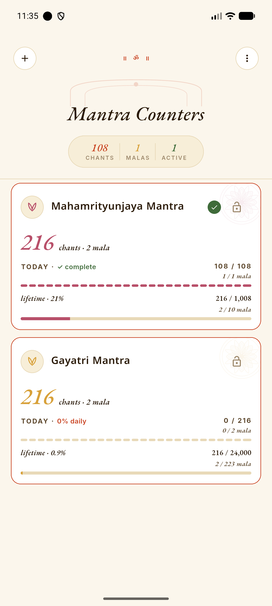
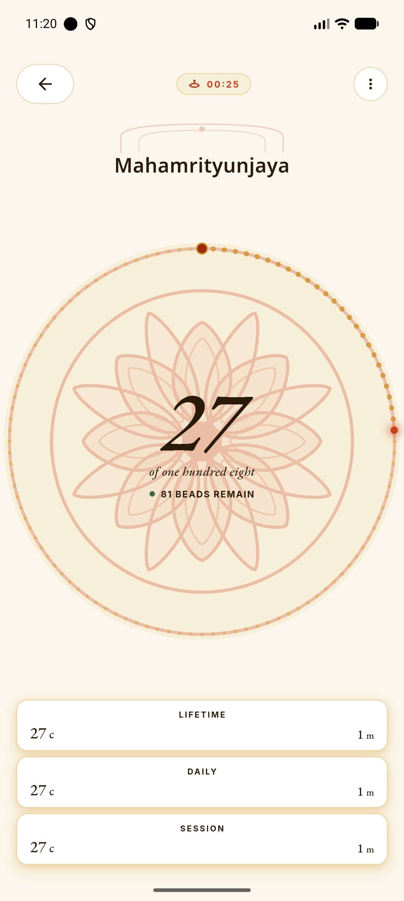
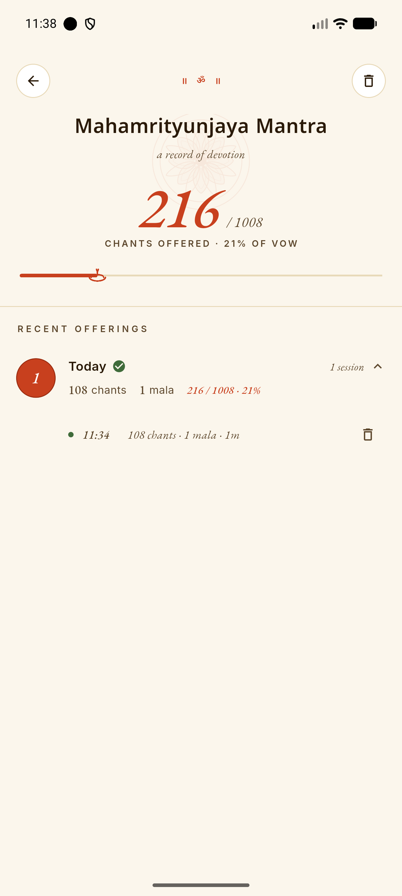
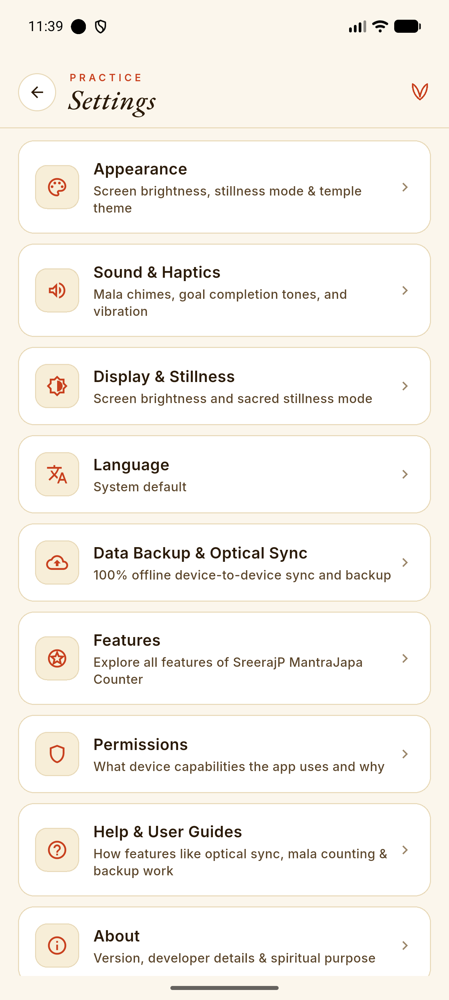
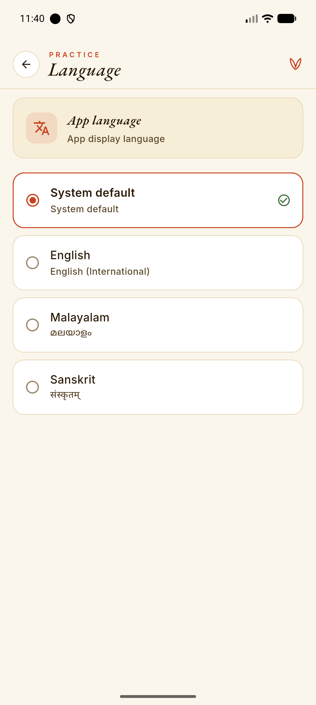
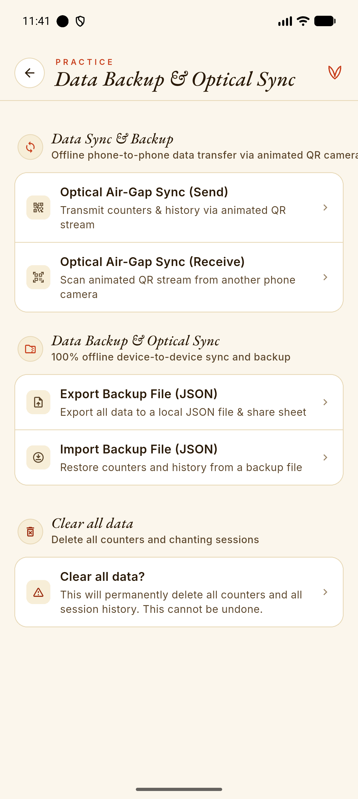

# SreerajP MantraJapa Counter

An offline Android app for counting mantra japa. It tracks your chant count, works out
completed malas (1 mala = 108 chants), keeps a practice history, and can move your data to
another phone using an on-screen QR stream — all without ever touching the network.

The app is strictly offline. It has no `INTERNET` permission, no analytics, no crash
reporting, and no cloud sync.

**Read [CLAUDE.md](CLAUDE.md) before changing anything.** It carries the project rules, and
[docs/GUIDELINES_MANIFEST.md](docs/GUIDELINES_MANIFEST.md) indexes the shared Flutter
guidelines.

---

## App Screenshots

| Home & Daily Offerings | Sacred Mala Counting | Practice History & Logs |
|:---:|:---:|:---:|
|  |  |  |

| Practice Settings | Multilingual Support | Stillness Mode & Backup |
|:---:|:---:|:---:|
|  |  |  |

---

## Key Features

- **Sacred 108-Bead Mala Counting**: Central bead circle with dynamic progress ring, bead countdown, and active duration timer.
- **Ergonomic Gestures & Lock**: Single-tap counting within the medallion, two-finger horizontal swipe to undo, and counter lock toggle to prevent accidental taps.
- **Multi-Counter Management**: Track unlimited mantra counters with customizable daily goals (offerings), lifetime vows (sankalpas), initial counts, and custom step sizes.
- **Visual Progress Indicators**: 27-segment prayer-bead daily progress strip, lotus watermarks, goal completion checkmarks, and today's summary pill.
- **Practice History & Analytics**: Date-grouped session logs, sitting duration, counts, malas, and vow completion progress with interactive Diya lamp track.
- **Stillness Meditation Mode**: Custom in-app display brightness control for extended meditation sittings.
- **Audio & Haptic Feedback**: Authentic Temple Bronze Bell, Sacred Shankha, soft synthesized mala tones, ringtone picker, custom audio files, and native alarms that work in silent mode.
- **Optical Air-Gap Sync**: 100% offline device-to-device synchronization using animated QR streams (Luby Transform fountain codes).
- **Multilingual Support**: Fully localized in English, Malayalam (മലയാളം), and Sanskrit (संस्कृतम्).
- **100% Offline & Private**: Zero internet permissions, zero telemetry, zero analytics, zero data leaving the device.

---

## 1. Prerequisites

| Tool | Version |
|------|---------|
| Flutter SDK | 3.44.8 or higher (stable channel) |
| Dart SDK | `^3.12.2` (ships with the Flutter version above) |
| Android SDK | compile/target SDK 35, min SDK 29 |
| JDK | 17 |
| Android NDK | The version Flutter reports for your SDK |

Check your setup with:

```bash
flutter doctor
```

---

## 2. Setup from a clean clone

The shared guidelines live in a Git submodule, so clone with `--recurse-submodules`.

```bash
git clone --recurse-submodules <REPOSITORY_URL>
cd MantraJapaCounter
flutter pub get
```

If you already cloned without submodules:

```bash
git submodule update --init --recursive
```

### `android/local.properties`

This file is machine-local and is **not** committed. Android Studio usually writes it for
you on first open. If a build complains that the Flutter SDK path is missing, create
`android/local.properties` with your own paths:

```properties
sdk.dir=<path to your Android SDK>
flutter.sdk=<path to your Flutter SDK>
```

You can set the `FLUTTER_ROOT` environment variable instead of `flutter.sdk`.

### `android/key.properties` (release builds only)

Needed only to build a signed `prod --release` artifact. See
[docs/release_process.md](docs/release_process.md). Never commit this file or the keystore.

---

## 3. Run the app

The project uses two build flavors. You must always pass `--flavor`.

```bash
flutter run --flavor dev      # daily development
flutter run --flavor prod     # production build with debug tooling
```

| Flavor | Application ID | Display name |
|--------|----------------|--------------|
| `dev` | `com.sreerajp.mantrajapacounter.dev` | SreerajP MantraJapa Counter Dev |
| `prod` | `com.sreerajp.mantrajapacounter` | SreerajP MantraJapa Counter |

Both flavors install side by side, so you can keep a dev build and a real build on one phone.

---

## 4. Run the tests

```bash
flutter test                              # every unit and widget test
flutter test test/core/utils/mala_test.dart    # a single file
flutter test --coverage                   # with coverage output
```

Static analysis must stay clean before you commit:

```bash
flutter analyze     # must report 0 issues
dart format .       # must leave no changes
```

---

## 5. Code generation

This project does **not** use `build_runner`. Three generators are used instead.

### 5.1 Localization (run after editing any `.arb` file)

```bash
flutter gen-l10n
```

Reads `l10n.yaml` and the ARB files in `lib/l10n/`, and writes
`lib/l10n/app_localizations*.dart`. Supported languages are English (`en`), Malayalam (`ml`),
and Sanskrit (`sa`). Every ARB key needs a matching `@key` description entry, and `app_ml.arb`
and `app_sa.arb` must carry the same keys as `app_en.arb`.

### 5.2 About-screen build metadata

```bash
dart run tool/generate_app_version.dart    # writes lib/core/utils/app_version.g.dart
dart run tool/generate_build_date.dart     # writes lib/core/utils/build_date.g.dart
```

You rarely run these by hand. The Gradle `generateBuildMetadata` task runs both before every
Android build, so the About screen always shows the version from `pubspec.yaml` and the real
build date.

---

## 6. Build commands

Production builds **must** use `--release`, `--obfuscate`, and `--split-debug-info`. Leaving
any of them out ships an unhardened, easily reverse-engineered artifact.

Replace `v6.12.1` below with the version in `pubspec.yaml`.

### Split APKs (direct install / sideloading)

```bash
flutter build apk --flavor prod --release \
  --obfuscate --split-debug-info=build/symbols/android-prod-v6.12.1/ --split-per-abi
```

Output: `build/app/outputs/apk/prod/release/app-arm64-v8a-prod-release.apk` and friends.

### App Bundle (Google Play)

```bash
flutter build appbundle --flavor prod --release \
  --obfuscate --split-debug-info=build/symbols/android-prod-v6.12.1/
```

Output: `build/app/outputs/bundle/prodRelease/app-prod-release.aab`.

### Dev build

```bash
flutter build apk --flavor dev --debug
```

> **Archive `build/symbols/` after every production build.** It is git-ignored on purpose.
> Without those symbol files, crash traces from a released build can never be decoded.

The full release runbook is in [docs/release_process.md](docs/release_process.md).

---

## 7. Environment values

There are no `--dart-define` values to pass. Flutter sets `FLUTTER_APP_FLAVOR` automatically
from `--flavor`, and the app reads it in Dart:

```dart
const String.fromEnvironment('FLUTTER_APP_FLAVOR')
```

See `lib/core/flavor/flavor_config.dart`.

---

## 8. Adding a database migration

The database is `japa_counter.db`, opened in `lib/main.dart` using `AppConstants.dbName` and
`AppConstants.dbVersion`. All schema code lives in
`lib/repositories/japa_counter_repository.dart`. The current schema version is **4**.

To add version N:

1. Add a `_createVN(Database db)` method to `JapaCounterRepository` holding only the changes
   for that version. Use `_addColumnIfMissing` for new columns and
   `CREATE TABLE IF NOT EXISTS` for new tables, so re-running is safe.
2. Call it at the end of `onCreate`, so a fresh install gets the full schema.
3. Add `if (oldVersion < N) await _createVN(db);` at the end of `onUpgrade`, so existing
   installs are upgraded.
4. Bump `AppConstants.dbVersion` to N in `lib/core/constants/app_constants.dart`. **This is the step
   that actually triggers the upgrade** — without it `onUpgrade` never runs.
5. Add a test to `test/repositories/japa_counter_repository_migration_test.dart` that opens a
   database at the old version, upgrades it, and asserts the new shape.
6. Never drop or rename a column that the JSON export format depends on. The export must stay
   byte-compatible with the original Android Room/Gson format.

---

## 9. Project layout

```
lib/
  core/
    config/       AppConfig + ConfigService (About-screen metadata)
    constants/    app constants & database version
    flavor/       build flavor detection
    locale/       supported locales & preferences
    routing/      GoRouter navigation configuration
    utils/        helpers & build metadata
  l10n/           ARB string files and generated localizations
  models/         pure Dart data models
  providers/      Riverpod state
  repositories/   sqflite and SharedPreferences access
  screens/        full-page screens
  services/       platform and business services
  theme/          colors, typography, temple design system
  widgets/        reusable UI widgets
docs/             architecture, security, release process, guidelines submodule
plans/            one plan per change, written before the change
change_log/       one log per change, written after the change
test/             mirrors lib/
tool/             build-metadata generator scripts
```

Details are in [docs/architecture.md](docs/architecture.md) and
[docs/project_structure.md](docs/project_structure.md).

---

## 10. Contributing rules

Every change follows plan-then-log:

1. Write a plan in `plans/` named `yyyymmdd_hhMMss_<short-slug>.md` with a `**Status:**` line.
2. Get explicit approval before editing anything.
3. Implement, then write a matching log in `change_log/`.

Files in `plans/` and `change_log/` are committed and may become public. They must use
relative repository paths only and must never contain local machine paths, secrets, or
personal details. See [docs/workflow_rules.md](docs/workflow_rules.md).

---

## 11. License

See [LICENSE](LICENSE).
